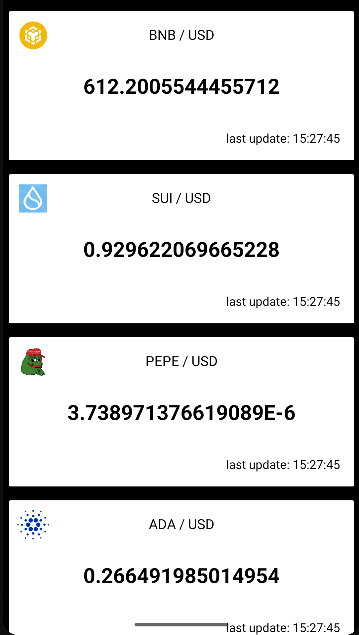

# 💰 Coins

**Coins** — Android-приложение для отображения курсов валют в реальном времени.  
Главная особенность: **курсы валют обновляются даже в фоне** с помощью **WorkManager**.

Проект написан на **Kotlin**, использует **MVVM**, **Retrofit**, **Room**, **Picasso** и **Dagger 2**.  
Архитектура реализована в стиле Clean Architecture (для практики), но основной упор — на работу фонового обновления данных.

---

## ✨ Основные возможности
- Отображение списка топ-валют с актуальными курсами  
- Детальная информация по выбранной валюте  
- Постоянное фоновое обновление данных через **WorkManager**  
- Локальное кэширование через **Room**  
- Получение данных из сети через **Retrofit**  
- Загрузка изображений валют через **Picasso**  
- MVVM и чистая архитектура для удобства поддержки (реализовано больше для галочки)  

---

## 🏗 Архитектура
Проект реализован в стиле **Clean Architecture**:

### 📦 Data
- Room для локального хранения валют  
- Retrofit для работы с API  
- Mapper для преобразования данных  
- Репозитории  

### ⚙️ Domain
- UseCases  
- Entity и интерфейсы репозиториев  

### 🎨 Presentation
- MVVM  
- Отображение списка валют и детальной информации  
- LiveData / StateFlow для реактивного UI  

### 🔄 Dependency Injection
- Dagger 2 (Modules, Component, Custom Scope)  

> Архитектура небольшая — основной акцент на работе фонового обновления данных через WorkManager.

---

## ⏱ Фоновая работа
Приложение обновляет курсы валют в фоне каждые 10 секунд с помощью **WorkManager**.  
Это позволяет пользователю всегда видеть актуальные данные, даже если приложение не активно.  

---

## 🛠 Используемые технологии
| Слой | Технологии |
|------|------------|
| Presentation | MVVM, LiveData / StateFlow |
| Domain | UseCases, Entity, Repository interfaces |
| Data | Room, Retrofit, Mapper |
| Фоновая работа | WorkManager |
| DI | Dagger 2 |
| Работа с изображениями | Picasso |
| Язык | Kotlin |

---

## 📸 Скриншоты

**Главный экран (список валют)**  

**Детальная информация о валюте**  

---

## 🚀 Запуск проекта
1. Склонировать репозиторий  
2. Открыть в Android Studio  
3. Запустить на эмуляторе или устройстве  

---

## 📌 Планы на будущее
- Добавить Unit-тесты и UI-тесты  
- Оптимизировать архитектуру и обработку ошибок  
- Возможность настраивать интервал фонового обновления  
- Улучшение UI и анимаций  

---

## 👤 Автор
Разработано с ❤️ на Kotlin
